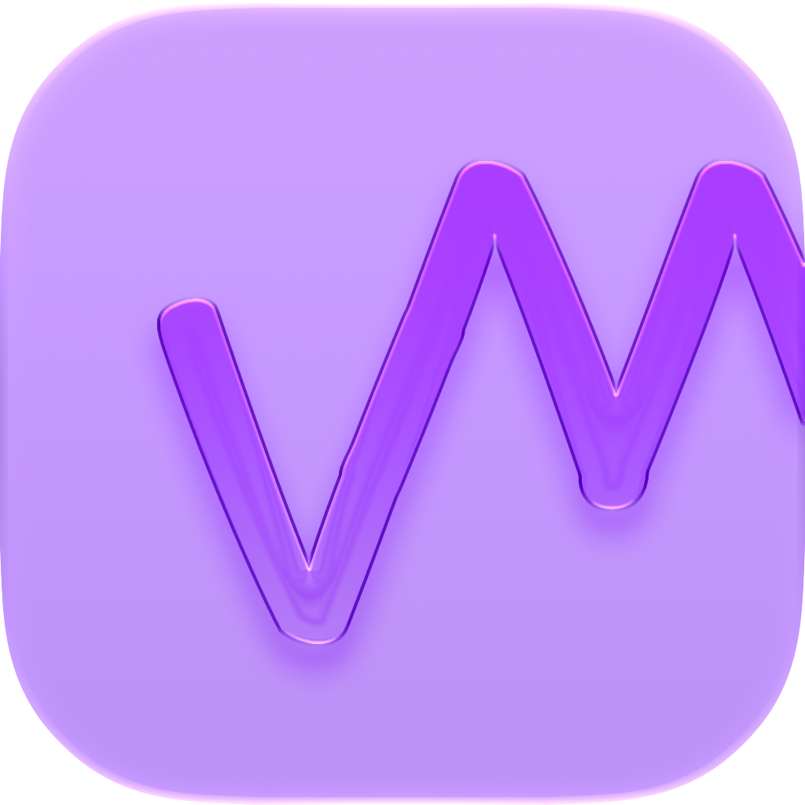

<p align="center">
  
</p>

<h1 align="center">Vector</h1>

**Understand how your body responds to training, for free, on your own device.**

Vector turns raw HealthKit signals into four daily scores: **Recovery**, **Exertion**, **Sleep**, and **Stress**, so you can see, in plain terms, how your body is actually reacting to the training and stress you're putting it through. It generates AI workouts, coaches progressive overload, and tracks nutrition (WIP), all powered by on-device Apple Intelligence.

## Why Vector exists

Most fitness apps treat your body like a black box: you log a workout, and it tells you a number. Want more insights? Well you have to pay for that. Vector is built around a different question: **what is my body telling me, and how do I read it?**

- **Recovery**: are you primed to train hard today, or should you back off?
- **Exertion**: how much strain did that workout actually place on your body, in and out of the gym?
- **Sleep**: is your sleep restoring you, and where is it falling short?
- **Stress**: what's your nervous system doing across the day, not just at rest?

Every score is computed from real Health signals (HRV, resting and daytime heart rate, sleeping respiratory rate, wrist temperature, SpO2, sleep stages) using transparent, testable scoring engines, not a black-box model. You can trace exactly why your Recovery dropped or your Stress spiked, and Vector connects the dots between them (e.g. "your Stress is elevated because Sleep debt is up three nights running").

On top of the scores, **Vector Intelligence** (an on-device AI advisor built on Apple's **FoundationModels**) explains what's driving your numbers, generates full workout plans, and coaches progressive overload, all reasoning that stays on your device, for free, instead of being locked behind a subscription tier.

## Features

- **Four daily scores**: Recovery, Exertion, Sleep, Stress, each with a detail view: hero value, trend chart, contributing factors, and cross-engine insights (how one score is influencing another).
- **AI-generated workouts**: describe what you want and get a structured plan via Apple's on-device FoundationModels (`@Generable` structs, no server round-trip).
- **Manual workout builder**: full control over exercises, sets, per-set weight/reps, and rest.
- **Active workout mode**: live in-workout logging, editable per-set targets, exertion tracking against an optimal-intensity target, synced to a **watchOS companion**.
- **Progressive overload coaching**: a `ProgressionAdvisor` that tracks your top sets over time and surfaces when to add weight, reps, or back off.
- **Vector Intelligence**: ask questions about your data ("why is my recovery low today?") and get answers reasoned live over your actual HealthKit history, with actions you can review and apply.
- **Siri & Shortcuts**: App Intents for Recovery, Sleep, Exertion, heart rate, weekly summaries, and asking Vector Intelligence directly from Siri or the Shortcuts app.
- **Home screen & Live Activity widgets**: scores at a glance, plus a Live Activity that tracks your workout in progress.
- **watchOS companion**: dashboard, live vitals, exertion, sleep, and recovery views, all synced from the phone.
- **Nutrition tracking** *(flagged off by default)*: AI food-photo analysis, meal scheduling, and baseline targets, ready to enable via `FeatureFlags`.

## Why "free" is the point

Apple already puts on-device intelligence, Siri, and comprehensive health sensing in every iPhone and Apple Watch. Vector's premise is that the interesting work, reading and explaining those signals, shouldn't require a subscription on top of hardware you already paid for. Every AI feature in Vector runs through Apple's on-device **FoundationModels**, not a hosted API, so there's no per-request cost to gate behind a paywall and no health data leaving your device.

## Architecture

Vector is a SwiftUI app built around `@Observable` state (the Observation framework, not Combine/`ObservableObject`).

```
Vector/            iOS app (target: com.jacobpantuso.Vector)
VectorWatch/        watchOS companion (com.jacobpantuso.Vector.watchkitapp)
VectorWidgets/       WidgetKit + Workout Live Activity (com.jacobpantuso.Vector.VectorWidgets)
Shared/              Code shared across targets (Live Activity attributes & intents)
```

**Entry point:** `Vector/VectorApp.swift` owns the core services and hosts a `TabView` (Home / Train / Nutrition* / Profile) gated behind onboarding.

**Services (`Vector/Services/`)**, the core logic layer:
- `HealthKitService`: central `@Observable` hub; reads HealthKit vitals and computes/holds all four scores.
- Score engines are pure, stateless `struct`s: `RecoveryEngine`, `StressEngine`, `TrainingLoadEngine` (exertion), `BaselineStatistics`. `SleepAnalysis` is computed from sleep data.
- `InsightEngine`, `ProgressionAdvisor`, `AdvisorContext`/`AdvisorTools`: Vector Intelligence and progressive-overload logic.
- `WorkoutPlanningEngine`: AI workout generation.
- Persistence stores (`WorkoutStorageService`, `ExerciseProgressionStore`, `ScoreHistoryStore`, `StressHistoryStore`, `SleepDebtStore`, `FoodLogService`, etc.): JSON/UserDefaults-backed `@Observable`s.
- `WatchSyncService`: `WCSession` bridge to the watch. The **iPhone owns the `HKWorkout`**; the watch never authors or finishes a workout, which avoids duplicate/phantom entries in Health.
- `WorkoutLiveActivityController`: drives the Live Activity.

**Models (`Vector/Models/`)**: value types for scores, workouts, exercises, user profile, and nutrition.

**Views (`Vector/Views/`)**: grouped by feature: `Dashboard/`, `Detail/`, `Train/`, `Nutrition/`, `Advisor/`, `Insights/`, `Onboarding/`, `Settings/`, plus reusable `Components/` (glass cards, rings, charts).

**Intents (`Vector/Intents/`)**: App Intents and Siri shortcuts with their own entities and snippet views.

## Vector Intelligence

Vector uses Apple's **FoundationModels** framework (`LanguageModelSession`, `@Generable`/`@Guide` result types) for workout generation and Vector Intelligence's advisor reasoning. Reasoning runs on-device via `SystemLanguageModel.default` by default (`AIModel.isPCCEnabled = false`), which is enough for most on-device model requests.

Private Cloud Compute is meant to be opted into for the requests that actually benefit from it, larger-context advisor reasoning or heavier generation tasks that exceed what the on-device model can comfortably handle, while keeping the same privacy guarantees as on-device inference. It's off by default while I work on getting access to PCC (flipping `AIModel.isPCCEnabled` to `true` routes eligible requests through `PrivateCloudComputeLanguageModel` once the build carries the required entitlement).

## Requirements

- Xcode with iOS 26 OR Xcode 27 Beta for iOS 27 Development / watchOS 26/27 SDKs
- A physical device for HealthKit data (the simulator has no real vitals; `HealthKitService.applyMockData()` provides sample data for DEBUG/simulator builds)
- Apple Intelligence-capable hardware for on-device AI features. iCloud+ plan for PCC access.

## Contributing

Vector is early and evolving quickly. Issues and PRs are welcome; see open issues for areas that need work, particularly around nutrition tracking (currently feature-flagged off) and additional score engines.

## License

*(Add a license file and name it here, e.g. MIT.)*
